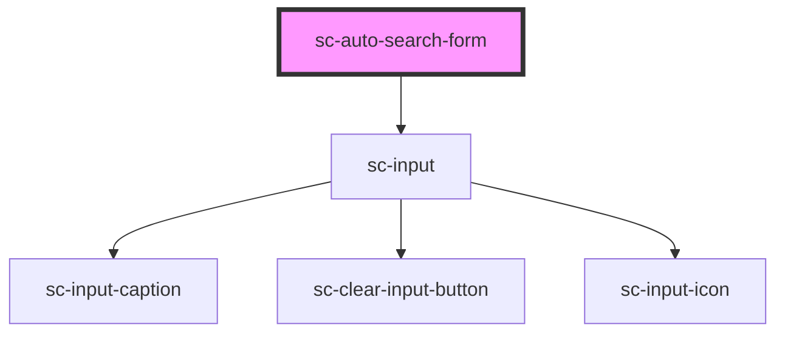

# sc-auto-search-form

<!-- Auto Generated Below -->

## Properties

| Property                 | Attribute                   | Description | Type            | Default                                                     |
| ------------------------ | --------------------------- | ----------- | --------------- | ----------------------------------------------------------- |
| `autoSearchFormClass`    | `auto-search-form-class`    |             | `string`        | `''`                                                        |
| `clearInput`             | --                          |             | `() => void`    | `() => {}`                                                  |
| `config`                 | --                          |             | `CoreConfigSDK` | `{     apiKey: '',     endpointURL: '',     index: [],   }` |
| `inputCaptionValue`      | `input-caption-value`       |             | `string`        | `''`                                                        |
| `labelForInput`          | `label-for-input`           |             | `string`        | `'Search'`                                                  |
| `placeholderValue`       | `placeholder-value`         |             | `string`        | `'Search here'`                                             |
| `rightToLeftOrientation` | `right-to-left-orientation` |             | `boolean`       | `false`                                                     |
| `searchContainerClass`   | `search-container-class`    |             | `string`        | `''`                                                        |

## Events

| Event         | Description                                 | Type                  |
| ------------- | ------------------------------------------- | --------------------- |
| `querySubmit` | Event emitted when the search query changes | `CustomEvent<string>` |

## Dependencies

### Depends on

- [sc-input](../sc-input)

### Graph

----------------------------------------------

*Built with [StencilJS](https://stenciljs.com/)*
