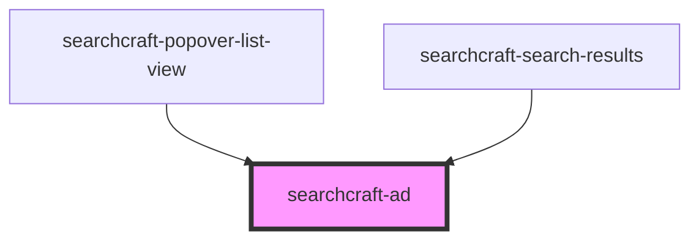

# searchcraft-popover-list-item-ad

<!-- Auto Generated Below -->

## Overview

An inline ad meant to be rendered in a list of search results.

## Properties

| Property               | Attribute         | Description | Type                                                | Default     |
| ---------------------- | ----------------- | ----------- | --------------------------------------------------- | ----------- |
| `adClientResponseItem` | --                |             | `AdClientResponseItem \| undefined`                 | `undefined` |
| `adContainerId`        | `ad-container-id` |             | `string`                                            | `nanoid()`  |
| `adSource`             | `ad-source`       |             | `"Custom" \| "Nativo" \| "None" \| "adMarketplace"` | `'Custom'`  |

## Dependencies

### Used by

 - [searchcraft-popover-list-view](../searchcraft-popover-list-view)
 - [searchcraft-search-results](../searchcraft-search-results)

### Graph

----------------------------------------------

*Built with [StencilJS](https://stenciljs.com/)*
