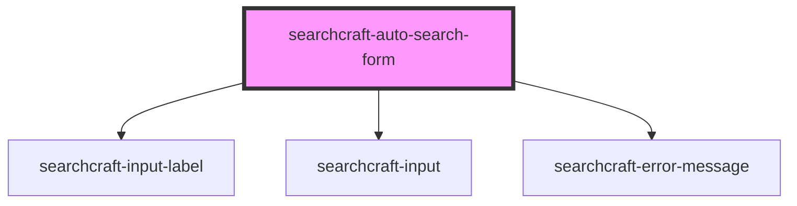

# sc-auto-search-form

<!-- Auto Generated Below -->

## Properties

| Property               | Attribute                 | Description | Type                                 | Default         |
| ---------------------- | ------------------------- | ----------- | ------------------------------------ | --------------- |
| `autoSearchFormClass`  | `auto-search-form-class`  |             | `string`                             | `''`            |
| `clearInput`           | --                        |             | `() => void`                         | `() => {}`      |
| `config`               | --                        |             | `SearchcraftConfig`                  | `undefined`     |
| `customStylesForInput` | `custom-styles-for-input` |             | `string \| { [x: string]: string; }` | `{}`            |
| `inputCaptionValue`    | `input-caption-value`     |             | `string`                             | `''`            |
| `labelForInput`        | `label-for-input`         |             | `string`                             | `''`            |
| `placeholderValue`     | `placeholder-value`       |             | `string`                             | `'Search here'` |
| `searchContainerClass` | `search-container-class`  |             | `string`                             | `''`            |

## Events

| Event                     | Description | Type                  |
| ------------------------- | ----------- | --------------------- |
| `inputClearedOrNoResults` |             | `CustomEvent<void>`   |
| `querySubmit`             |             | `CustomEvent<string>` |

## Dependencies

### Depends on

- [searchcraft-input-label](../searchcraft-input-label)
- [searchcraft-input](../searchcraft-input)
- [searchcraft-error-message](../searchcraft-error-message)

### Graph

----------------------------------------------

*Built with [StencilJS](https://stenciljs.com/)*
