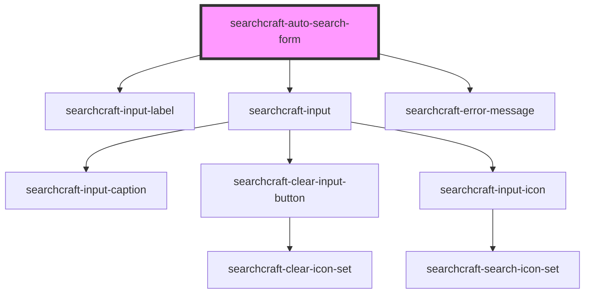

# sc-auto-search-form

<!-- Auto Generated Below -->

## Properties

| Property                 | Attribute                   | Description | Type                                 | Default                                                                              |
| ------------------------ | --------------------------- | ----------- | ------------------------------------ | ------------------------------------------------------------------------------------ |
| `autoSearchFormClass`    | `auto-search-form-class`    |             | `string`                             | `''`                                                                                 |
| `clearInput`             | --                          |             | `() => void`                         | `() => {}`                                                                           |
| `config`                 | --                          |             | `SearchcraftConfig`                  | `{     readKey: '',     endpointURL: '',     index: [],     organizationId: '',   }` |
| `customStylesForInput`   | `custom-styles-for-input`   |             | `string \| { [x: string]: string; }` | `{}`                                                                                 |
| `inputCaptionValue`      | `input-caption-value`       |             | `string`                             | `''`                                                                                 |
| `inputIconHeight`        | `input-icon-height`         |             | `number`                             | `20`                                                                                 |
| `inputIconWidth`         | `input-icon-width`          |             | `number`                             | `20`                                                                                 |
| `labelForInput`          | `label-for-input`           |             | `string`                             | `''`                                                                                 |
| `placeholderValue`       | `placeholder-value`         |             | `string`                             | `'Search here'`                                                                      |
| `rightToLeftOrientation` | `right-to-left-orientation` |             | `boolean`                            | `false`                                                                              |
| `searchContainerClass`   | `search-container-class`    |             | `string`                             | `''`                                                                                 |

## Events

| Event                     | Description | Type                  |
| ------------------------- | ----------- | --------------------- |
| `inputClearedOrNoResults` |             | `CustomEvent<void>`   |
| `querySubmit`             |             | `CustomEvent<string>` |

## Dependencies

### Depends on

- [searchcraft-input-label](../searchcraft-input-label)
- [searchcraft-input](../searchcraft-input)
- [searchcraft-error-message](../searchcraft-error-message)

### Graph

----------------------------------------------

*Built with [StencilJS](https://stenciljs.com/)*
