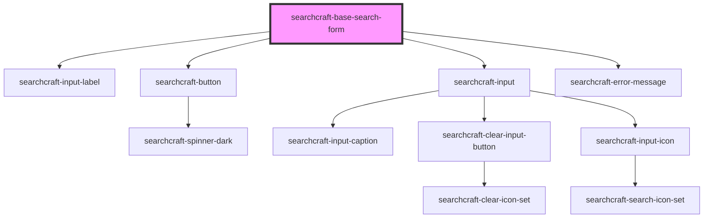

# sc-base-search-form

<!-- Auto Generated Below -->

## Properties

| Property                 | Attribute                   | Description | Type                | Default                                                                              |
| ------------------------ | --------------------------- | ----------- | ------------------- | ------------------------------------------------------------------------------------ |
| `config`                 | --                          |             | `SearchcraftConfig` | `{     readKey: '',     endpointURL: '',     index: [],     organizationId: '',   }` |
| `errorMessage`           | `error-message`             |             | `string`            | `'Search was unsuccessful'`                                                          |
| `labelForInput`          | `label-for-input`           |             | `string`            | `'Search'`                                                                           |
| `rightToLeftOrientation` | `right-to-left-orientation` |             | `boolean`           | `false`                                                                              |

## Events

| Event        | Description | Type               |
| ------------ | ----------- | ------------------ |
| `clearInput` |             | `CustomEvent<any>` |

## Dependencies

### Depends on

- [searchcraft-input-label](../searchcraft-input-label)
- [searchcraft-button](../searchcraft-button)
- [searchcraft-input](../searchcraft-input)
- [searchcraft-error-message](../searchcraft-error-message)

### Graph

----------------------------------------------

*Built with [StencilJS](https://stenciljs.com/)*
