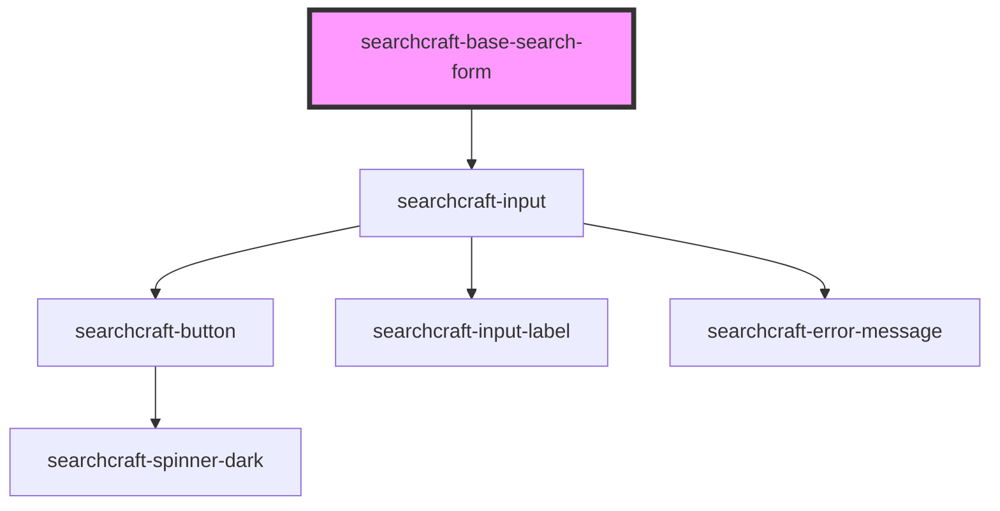

# sc-base-search-form

<!-- Auto Generated Below -->

## Properties

| Property           | Attribute           | Description | Type                | Default                     |
| ------------------ | ------------------- | ----------- | ------------------- | --------------------------- |
| `buttonLabel`      | `button-label`      |             | `string`            | `'Find'`                    |
| `buttonPlacement`  | `button-placement`  |             | `"left" \| "right"` | `'right'`                   |
| `config`           | --                  |             | `SearchcraftConfig` | `undefined`                 |
| `errorMessage`     | `error-message`     |             | `string`            | `'Search was unsuccessful'` |
| `inputLabel`       | `input-label`       |             | `string`            | `'Search'`                  |
| `placeholderValue` | `placeholder-value` |             | `string`            | `'Search here'`             |

## Events

| Event          | Description | Type                |
| -------------- | ----------- | ------------------- |
| `inputCleared` |             | `CustomEvent<void>` |

## Dependencies

### Depends on

- [searchcraft-input](../searchcraft-input)

### Graph

----------------------------------------------

*Built with [StencilJS](https://stenciljs.com/)*
