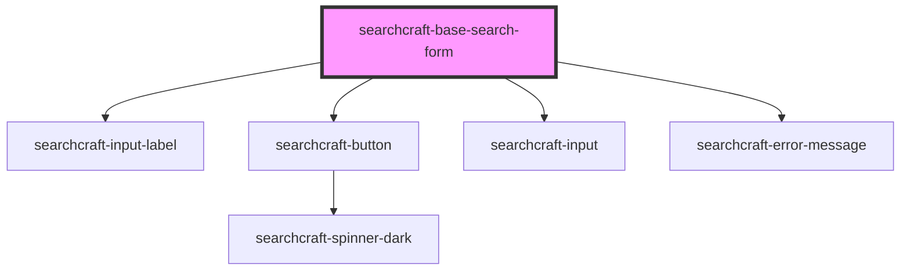

# sc-base-search-form

<!-- Auto Generated Below -->

## Properties

| Property          | Attribute          | Description | Type                | Default                                                      |
| ----------------- | ------------------ | ----------- | ------------------- | ------------------------------------------------------------ |
| `buttonLabel`     | `button-label`     |             | `string`            | `'Find'`                                                     |
| `buttonPlacement` | `button-placement` |             | `"left" \| "right"` | `'right'`                                                    |
| `config`          | --                 |             | `SearchcraftConfig` | `{     readKey: '',     endpointURL: '',     index: [],   }` |
| `errorMessage`    | `error-message`    |             | `string`            | `'Search was unsuccessful'`                                  |
| `inputLabel`      | `input-label`      |             | `string`            | `'Search'`                                                   |

## Events

| Event        | Description | Type               |
| ------------ | ----------- | ------------------ |
| `clearInput` |             | `CustomEvent<any>` |

## Dependencies

### Depends on

- [searchcraft-input-label](../searchcraft-input-label)
- [searchcraft-button](../searchcraft-button)
- [searchcraft-input](../searchcraft-input)
- [searchcraft-error-message](../searchcraft-error-message)

### Graph

----------------------------------------------

*Built with [StencilJS](https://stenciljs.com/)*
