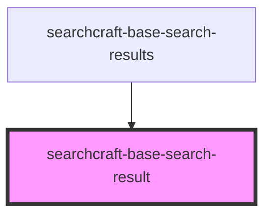

# sc-base-search-result

<!-- Auto Generated Below -->

## Properties

| Property           | Attribute           | Description | Type                | Default   |
| ------------------ | ------------------- | ----------- | ------------------- | --------- |
| `buttonText`       | `button-text`       |             | `string`            | `''`      |
| `customStyles`     | `custom-styles`     |             | `string`            | `'{}'`    |
| `headingText`      | `heading-text`      |             | `string`            | `''`      |
| `imageDescription` | `image-description` |             | `string`            | `''`      |
| `imageSource`      | `image-source`      |             | `string`            | `''`      |
| `isInteractive`    | `is-interactive`    |             | `boolean`           | `false`   |
| `primaryContent`   | `primary-content`   |             | `string`            | `''`      |
| `secondaryContent` | `secondary-content` |             | `string`            | `''`      |
| `subheadingText`   | `subheading-text`   |             | `string`            | `''`      |
| `tertiaryContent`  | `tertiary-content`  |             | `string`            | `''`      |
| `themeMode`        | `theme-mode`        |             | `"dark" \| "light"` | `'light'` |

## Events

| Event             | Description | Type               |
| ----------------- | ----------- | ------------------ |
| `buttonCallback`  |             | `CustomEvent<any>` |
| `keyDownCallback` |             | `CustomEvent<any>` |
| `resultCallback`  |             | `CustomEvent<any>` |

## Dependencies

### Used by

 - [searchcraft-base-search-results](../searchcraft-base-search-results)

### Graph

----------------------------------------------

*Built with [StencilJS](https://stenciljs.com/)*
