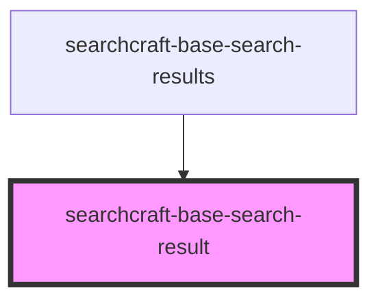

# sc-base-search-result

<!-- Auto Generated Below -->

## Properties

| Property           | Attribute           | Description | Type                                         | Default     |
| ------------------ | ------------------- | ----------- | -------------------------------------------- | ----------- |
| `bodyContent`      | `body-content`      |             | `string`                                     | `undefined` |
| `buttonHref`       | `button-href`       |             | `string`                                     | `undefined` |
| `buttonLabel`      | `button-label`      |             | `string`                                     | `undefined` |
| `buttonRel`        | `button-rel`        |             | `"nofollow" \| "noopener" \| "noreferrer"`   | `undefined` |
| `buttonTarget`     | `button-target`     |             | `"_blank" \| "_parent" \| "_self" \| "_top"` | `'_blank'`  |
| `containerHref`    | `container-href`    |             | `string`                                     | `undefined` |
| `containerRel`     | `container-rel`     |             | `"nofollow" \| "noopener" \| "noreferrer"`   | `undefined` |
| `containerTarget`  | `container-target`  |             | `"_blank" \| "_parent" \| "_self" \| "_top"` | `'_blank'`  |
| `customStyles`     | `custom-styles`     |             | `string`                                     | `undefined` |
| `documentPosition` | `document-position` |             | `number`                                     | `0`         |
| `footerContent`    | `footer-content`    |             | `string`                                     | `undefined` |
| `imageAlt`         | `image-alt`         |             | `string`                                     | `undefined` |
| `imagePlacement`   | `image-placement`   |             | `"left" \| "right"`                          | `undefined` |
| `imageSrc`         | `image-src`         |             | `string`                                     | `undefined` |
| `subtitleContent`  | `subtitle-content`  |             | `string`                                     | `undefined` |
| `titleContent`     | `title-content`     |             | `string`                                     | `undefined` |

## Dependencies

### Used by

 - [searchcraft-base-search-results](../searchcraft-base-search-results)

### Graph

----------------------------------------------

*Built with [StencilJS](https://stenciljs.com/)*
