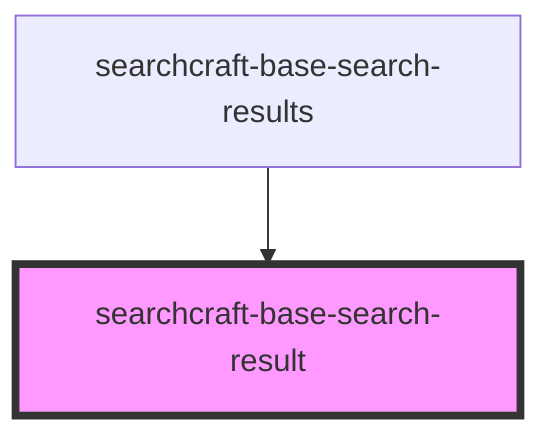

# sc-base-search-result

<!-- Auto Generated Below -->

## Overview

This web component is designed to display detailed information for a single search result.
Once a query is submitted, the component formats and presents the result.
It is consumed within the `searchcraft-base-search-results` component.

## Properties

| Property           | Attribute           | Description                                                                                                           | Type                                                    | Default     |
| ------------------ | ------------------- | --------------------------------------------------------------------------------------------------------------------- | ------------------------------------------------------- | ----------- |
| `bodyContent`      | `body-content`      | The body content.                                                                                                     | `string \| undefined`                                   | `undefined` |
| `buttonHref`       | `button-href`       | The link for the button rendered when containerHref is not present.                                                   | `string \| undefined`                                   | `undefined` |
| `buttonLabel`      | `button-label`      | The label for the button rendered when containerHref is not present.                                                  | `string \| undefined`                                   | `undefined` |
| `buttonRel`        | `button-rel`        | The relationship between the current document and the link for the button rendered when containerHref is not present. | `"nofollow" \| "noopener" \| "noreferrer" \| undefined` | `undefined` |
| `buttonTarget`     | `button-target`     | Where to open the link for the button rendered when containerHref is not present.                                     | `"_blank" \| "_parent" \| "_self" \| "_top"`            | `'_blank'`  |
| `containerHref`    | `container-href`    | The link for the containing element.                                                                                  | `string \| undefined`                                   | `undefined` |
| `containerRel`     | `container-rel`     | The relationship between the current document and the link for the containing element.                                | `"nofollow" \| "noopener" \| "noreferrer" \| undefined` | `undefined` |
| `containerTarget`  | `container-target`  | Where to open the link for the containing element.                                                                    | `"_blank" \| "_parent" \| "_self" \| "_top"`            | `'_blank'`  |
| `customStyles`     | `custom-styles`     | A custom styles object.                                                                                               | `string \| undefined`                                   | `undefined` |
| `documentPosition` | `document-position` | The position in the document. Used with the "document_clicked" measure event.                                         | `number`                                                | `0`         |
| `footerContent`    | `footer-content`    | The footer content.                                                                                                   | `string \| undefined`                                   | `undefined` |
| `imageAlt`         | `image-alt`         | The image alternative text.                                                                                           | `string \| undefined`                                   | `undefined` |
| `imagePlacement`   | `image-placement`   | The placement of the image.                                                                                           | `"left" \| "right"`                                     | `'right'`   |
| `imageSrc`         | `image-src`         | The image source.                                                                                                     | `string \| undefined`                                   | `undefined` |
| `subtitleContent`  | `subtitle-content`  | The subtitle content.                                                                                                 | `string \| undefined`                                   | `undefined` |
| `titleContent`     | `title-content`     | The title content.                                                                                                    | `string \| undefined`                                   | `undefined` |

## Dependencies

### Used by

 - [searchcraft-base-search-results](../searchcraft-base-search-results)

### Graph

----------------------------------------------

*Built with [StencilJS](https://stenciljs.com/)*
