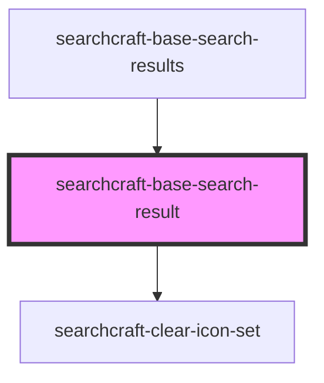

# sc-base-search-result

<!-- Auto Generated Below -->

## Properties

| Property            | Attribute             | Description | Type                | Default    |
| ------------------- | --------------------- | ----------- | ------------------- | ---------- |
| `buttonCallbackFn`  | --                    |             | `() => void`        | `() => {}` |
| `buttonLabel`       | `button-label`        |             | `string`            | `''`       |
| `callbackFn`        | --                    |             | `() => void`        | `() => {}` |
| `imageAltText`      | `image-alt-text`      |             | `string`            | `''`       |
| `imageSrc`          | `image-src`           |             | `string`            | `''`       |
| `interactiveResult` | `interactive-result`  |             | `boolean`           | `false`    |
| `keyDownCallbackFn` | --                    |             | `() => void`        | `() => {}` |
| `resultBodyContent` | `result-body-content` |             | `string`            | `''`       |
| `resultHeading`     | `result-heading`      |             | `string`            | `''`       |
| `resultSubheading`  | `result-subheading`   |             | `string`            | `''`       |
| `theme`             | `theme`               |             | `"dark" \| "light"` | `'light'`  |

## Dependencies

### Used by

 - [searchcraft-base-search-results](../searchcraft-base-search-results)

### Depends on

- [searchcraft-clear-icon-set](../../assets)

### Graph

----------------------------------------------

*Built with [StencilJS](https://stenciljs.com/)*
