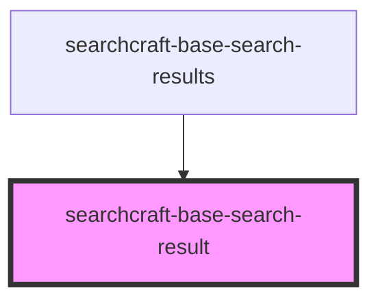

# sc-base-search-result

<!-- Auto Generated Below -->

## Properties

| Property           | Attribute           | Description | Type                | Default     |
| ------------------ | ------------------- | ----------- | ------------------- | ----------- |
| `bodyContent`      | `body-content`      |             | `string`            | `''`        |
| `buttonLabel`      | `button-label`      |             | `string`            | `''`        |
| `customStyles`     | `custom-styles`     |             | `string`            | `'{}'`      |
| `documentPosition` | `document-position` |             | `number`            | `0`         |
| `footerContent`    | `footer-content`    |             | `string`            | `''`        |
| `imageDescription` | `image-description` |             | `string`            | `''`        |
| `imagePlacement`   | `image-placement`   |             | `"left" \| "right"` | `undefined` |
| `imageSource`      | `image-source`      |             | `string`            | `''`        |
| `linkHref`         | `link-href`         |             | `string`            | `''`        |
| `subtitleContent`  | `subtitle-content`  |             | `string`            | `''`        |
| `titleContent`     | `title-content`     |             | `string`            | `''`        |

## Events

| Event             | Description | Type               |
| ----------------- | ----------- | ------------------ |
| `buttonCallback`  |             | `CustomEvent<any>` |
| `keyDownCallback` |             | `CustomEvent<any>` |
| `resultCallback`  |             | `CustomEvent<any>` |

## Dependencies

### Used by

 - [searchcraft-base-search-results](../searchcraft-base-search-results)

### Graph

----------------------------------------------

*Built with [StencilJS](https://stenciljs.com/)*
