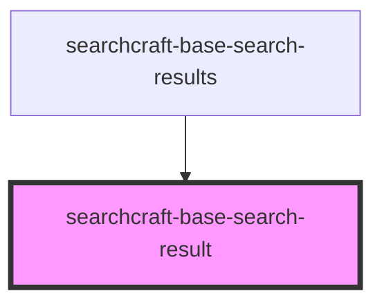

# sc-base-search-result

<!-- Auto Generated Below -->

## Overview

This web component is designed to display detailed information for a single search result.
Once a query is submitted, the component formats and presents the result.
It is consumed within the `searchcraft-base-search-results` component.

## Properties

| Property               | Attribute           | Description                                                                                                           | Type                                                                                                                                                                                                                                                                                                                                           | Default     |
| ---------------------- | ------------------- | --------------------------------------------------------------------------------------------------------------------- | ---------------------------------------------------------------------------------------------------------------------------------------------------------------------------------------------------------------------------------------------------------------------------------------------------------------------------------------------- | ----------- |
| `buttonRel`            | `button-rel`        | The relationship between the current document and the link for the button rendered when containerHref is not present. | `"nofollow" \| "noopener" \| "noreferrer" \| undefined`                                                                                                                                                                                                                                                                                        | `undefined` |
| `buttonTarget`         | `button-target`     | Where to open the link for the button rendered when containerHref is not present.                                     | `"_blank" \| "_parent" \| "_self" \| "_top"`                                                                                                                                                                                                                                                                                                   | `'_blank'`  |
| `containerRel`         | `container-rel`     | The relationship between the current document and the link for the containing element.                                | `"nofollow" \| "noopener" \| "noreferrer" \| undefined`                                                                                                                                                                                                                                                                                        | `undefined` |
| `containerTarget`      | `container-target`  | Where to open the link for the containing element.                                                                    | `"_blank" \| "_parent" \| "_self" \| "_top"`                                                                                                                                                                                                                                                                                                   | `'_blank'`  |
| `customStyles`         | `custom-styles`     | A custom styles object.                                                                                               | `string \| undefined`                                                                                                                                                                                                                                                                                                                          | `undefined` |
| `documentPosition`     | `document-position` | The position in the document. Used with the "document_clicked" measure event.                                         | `number`                                                                                                                                                                                                                                                                                                                                       | `0`         |
| `imagePlacement`       | `image-placement`   | The placement of the image.                                                                                           | `"left" \| "right"`                                                                                                                                                                                                                                                                                                                            | `'right'`   |
| `item`                 | --                  |                                                                                                                       | `SearchClientResponseItem \| undefined`                                                                                                                                                                                                                                                                                                        | `undefined` |
| `searchResultMappings` | --                  |                                                                                                                       | `undefined \| { body?: SearchResultMapping \| undefined; buttonHref?: SearchResultMapping \| undefined; containerHref?: SearchResultMapping \| undefined; footer?: SearchResultMapping \| undefined; imageSource?: SearchResultMapping \| undefined; subtitle?: SearchResultMapping \| undefined; title?: SearchResultMapping \| undefined; }` | `undefined` |

## Dependencies

### Used by

 - [searchcraft-base-search-results](../searchcraft-base-search-results)

### Graph

----------------------------------------------

*Built with [StencilJS](https://stenciljs.com/)*
