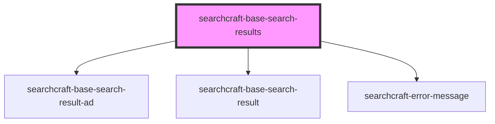

# sc-base-search-results


<!-- Auto Generated Below -->


## Overview

This web component is responsible for displaying the results of a search query.
Once a query is submitted, the component formats and presents an ordered list of the results.

## Usage
```html
<!-- index.html -->
<searchcraft-base-search-results
  ad-interval="4"
  place-ad-at-start="false"
  result-image-placement="right"
/>
```

```js
// index.js
const baseSearchResults = document.querySelector('searchcraft-base-search-results');

baseSearchResults.searchResultMappings = containerHref: {
  fieldNames: [
   {
     fieldName: 'canonical_link',
     dataType: 'text',
   },
 ],
};

baseSearchResults.addEventListener('noResults', () => {
  console.log('No search results found');
});
```

## Properties

| Property                 | Attribute                   | Description                                                                                                                           | Type                                                                                                                                                                                                                                                                                                                                           | Default     |
| ------------------------ | --------------------------- | ------------------------------------------------------------------------------------------------------------------------------------- | ---------------------------------------------------------------------------------------------------------------------------------------------------------------------------------------------------------------------------------------------------------------------------------------------------------------------------------------------- | ----------- |
| `buttonLabel`            | `button-label`              | The label for the button rendered when containerHref is not present for each result.                                                  | `string \| undefined`                                                                                                                                                                                                                                                                                                                          | `undefined` |
| `buttonRel`              | `button-rel`                | The relationship between the current document and the link for the button rendered when containerHref is not present for each result. | `"nofollow" \| "noopener" \| "noreferrer" \| undefined`                                                                                                                                                                                                                                                                                        | `undefined` |
| `buttonTarget`           | `button-target`             | Where to open the link for the button rendered when containerHref is not present for each result.                                     | `"_blank" \| "_parent" \| "_self" \| "_top"`                                                                                                                                                                                                                                                                                                   | `'_blank'`  |
| `containerRel`           | `container-rel`             | The relationship between the current document and the link for the containing element for each result.                                | `"nofollow" \| "noopener" \| "noreferrer" \| undefined`                                                                                                                                                                                                                                                                                        | `undefined` |
| `containerTarget`        | `container-target`          | Where to open the link for the containing element for each result.                                                                    | `"_blank" \| "_parent" \| "_self" \| "_top"`                                                                                                                                                                                                                                                                                                   | `'_blank'`  |
| `customStylesForResults` | `custom-styles-for-results` | A custom styles object.                                                                                                               | `string \| undefined \| { [x: string]: Record<string, string>; }`                                                                                                                                                                                                                                                                              | `undefined` |
| `resultImagePlacement`   | `result-image-placement`    | The placement of the image for each result.                                                                                           | `"left" \| "right"`                                                                                                                                                                                                                                                                                                                            | `'right'`   |
| `searchResultMappings`   | --                          | Formats the content rendered for each result.                                                                                         | `undefined \| { body?: SearchResultMapping \| undefined; buttonHref?: SearchResultMapping \| undefined; containerHref?: SearchResultMapping \| undefined; footer?: SearchResultMapping \| undefined; imageSource?: SearchResultMapping \| undefined; subtitle?: SearchResultMapping \| undefined; title?: SearchResultMapping \| undefined; }` | `undefined` |


## Events

| Event       | Description                   | Type                |
| ----------- | ----------------------------- | ------------------- |
| `noResults` | When no results are returned. | `CustomEvent<void>` |


## Dependencies

### Depends on

- [searchcraft-base-search-result-ad](../searchcraft-base-search-result-ad)
- [searchcraft-base-search-result](../searchcraft-base-search-result)
- [searchcraft-error-message](../searchcraft-error-message)

### Graph


----------------------------------------------

*Built with [StencilJS](https://stenciljs.com/)*
