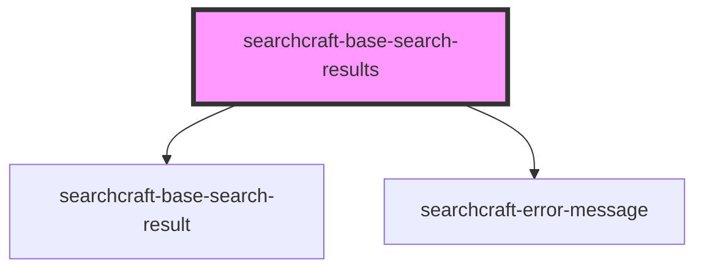

# sc-base-search-results

<!-- Auto Generated Below -->

## Properties

| Property                       | Attribute                         | Description | Type                                                 | Default |
| ------------------------------ | --------------------------------- | ----------- | ---------------------------------------------------- | ------- |
| `adInterval`                   | `ad-interval`                     |             | `number`                                             | `4`     |
| `customStylesForResults`       | `custom-styles-for-results`       |             | `string \| { [x: string]: Record<string, string>; }` | `{}`    |
| `documentAttributesForDisplay` | `document-attributes-for-display` |             | `string`                                             | `''`    |
| `fallbackElement`              | --                                |             | `HTMLElement`                                        | `null`  |
| `formatTime`                   | `format-time`                     |             | `boolean`                                            | `true`  |
| `isInteractive`                | `is-interactive`                  |             | `boolean`                                            | `false` |
| `placeAdAtEnd`                 | `place-ad-at-end`                 |             | `boolean`                                            | `false` |
| `placeAdAtStart`               | `place-ad-at-start`               |             | `boolean`                                            | `true`  |
| `placeResultImageRight`        | `place-result-image-right`        |             | `boolean`                                            | `false` |

## Events

| Event       | Description | Type                |
| ----------- | ----------- | ------------------- |
| `noResults` |             | `CustomEvent<void>` |

## Dependencies

### Depends on

- [searchcraft-base-search-result](../searchcraft-base-search-result)
- [searchcraft-error-message](../searchcraft-error-message)

### Graph

----------------------------------------------

*Built with [StencilJS](https://stenciljs.com/)*
