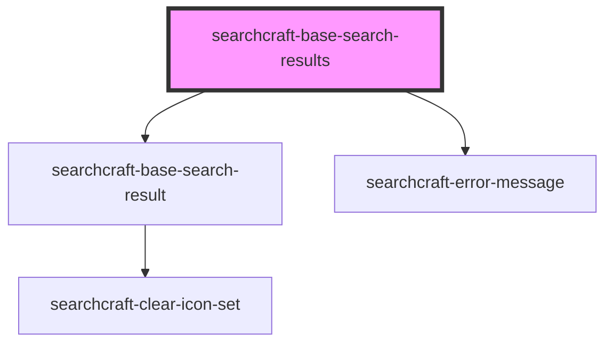

# sc-base-search-results

<!-- Auto Generated Below -->

## Properties

| Property     | Attribute     | Description                                                                                                         | Type     | Default |
| ------------ | ------------- | ------------------------------------------------------------------------------------------------------------------- | -------- | ------- |
| `searchKeys` | `search-keys` | Array of keys to dynamically extract properties from each document. Must be explicitly set by the parent component. | `string` | `''`    |

## Dependencies

### Depends on

- [searchcraft-base-search-result](../searchcraft-base-search-result)
- [searchcraft-error-message](../searchcraft-error-message)

### Graph

----------------------------------------------

*Built with [StencilJS](https://stenciljs.com/)*
