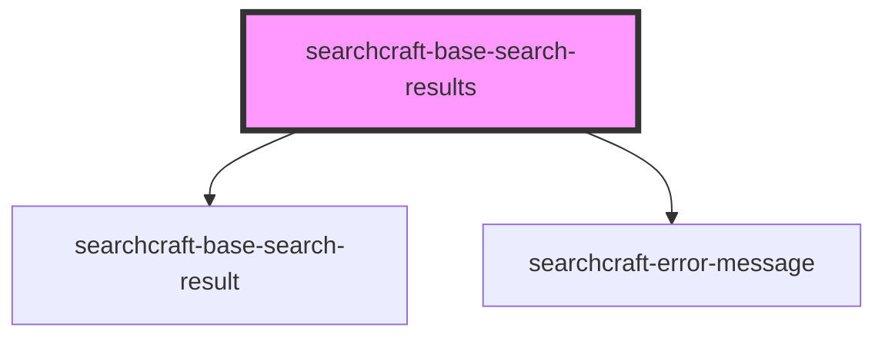

# sc-base-search-results

<!-- Auto Generated Below -->

## Properties

| Property                 | Attribute                   | Description                                                                                                                 | Type                                                 | Default |
| ------------------------ | --------------------------- | --------------------------------------------------------------------------------------------------------------------------- | ---------------------------------------------------- | ------- |
| `adInterval`             | `ad-interval`               | Place ad every N results (e.g., every 4 results). Default value: 4                                                          | `number`                                             | `4`     |
| `customStylesForResults` | `custom-styles-for-results` | Custom styles to apply to search results. Expected format: JSON string, e.g., '{"borderRadius": "10px", "padding": "16px"}' | `string \| { [x: string]: Record<string, string>; }` | `{}`    |
| `placeAdAtEnd`           | `place-ad-at-end`           | Place ad at the end of the results.                                                                                         | `boolean`                                            | `false` |
| `searchKeys`             | `search-keys`               | Array of keys to dynamically extract properties from each document. Must be explicitly set by the parent component.         | `string`                                             | `''`    |

## Dependencies

### Depends on

- [searchcraft-base-search-result](../searchcraft-base-search-result)
- [searchcraft-error-message](../searchcraft-error-message)

### Graph

----------------------------------------------

*Built with [StencilJS](https://stenciljs.com/)*
