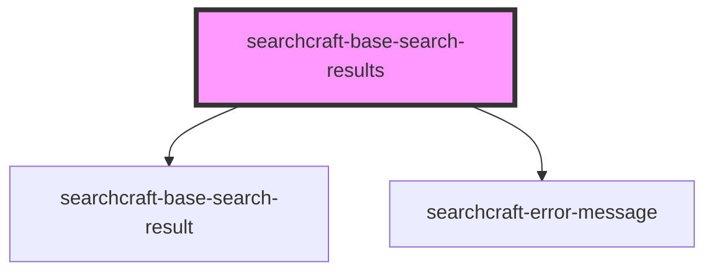

# sc-base-search-results

<!-- Auto Generated Below -->

## Properties

| Property                 | Attribute                   | Description | Type                                                 | Default     |
| ------------------------ | --------------------------- | ----------- | ---------------------------------------------------- | ----------- |
| `adInterval`             | `ad-interval`               |             | `number`                                             | `4`         |
| `buttonLabel`            | `button-label`              |             | `string`                                             | `undefined` |
| `buttonRel`              | `button-rel`                |             | `"nofollow" \| "noopener" \| "noreferrer"`           | `undefined` |
| `buttonTarget`           | `button-target`             |             | `"_blank" \| "_parent" \| "_self" \| "_top"`         | `'_blank'`  |
| `containerHref`          | `container-href`            |             | `string`                                             | `undefined` |
| `containerRel`           | `container-rel`             |             | `"nofollow" \| "noopener" \| "noreferrer"`           | `undefined` |
| `containerTarget`        | `container-target`          |             | `"_blank" \| "_parent" \| "_self" \| "_top"`         | `'_blank'`  |
| `customStylesForResults` | `custom-styles-for-results` |             | `string \| { [x: string]: Record<string, string>; }` | `undefined` |
| `placeAdAtEnd`           | `place-ad-at-end`           |             | `boolean`                                            | `false`     |
| `placeAdAtStart`         | `place-ad-at-start`         |             | `boolean`                                            | `true`      |
| `resultImagePlacement`   | `result-image-placement`    |             | `"left" \| "right"`                                  | `'right'`   |
| `searchResultMappings`   | `search-result-mappings`    |             | `string`                                             | `undefined` |

## Events

| Event       | Description | Type                |
| ----------- | ----------- | ------------------- |
| `noResults` |             | `CustomEvent<void>` |

## Dependencies

### Depends on

- [searchcraft-base-search-result](../searchcraft-base-search-result)
- [searchcraft-error-message](../searchcraft-error-message)

### Graph

----------------------------------------------

*Built with [StencilJS](https://stenciljs.com/)*
