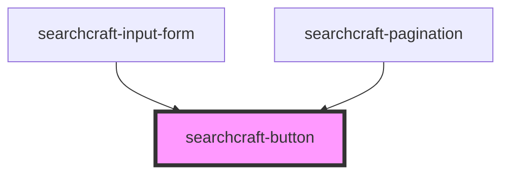

# sc-button

<!-- Auto Generated Below -->

## Overview

This web component represents a button to be consumed within the `search-input-form` component.
It provides a clear, interactive way for users to submit search queries or trigger actions in a search interface.
It is consumed within the `searchcraft-input-form` component.

## Properties

| Property       | Attribute       | Description                                       | Type                                           | Default     |
| -------------- | --------------- | ------------------------------------------------- | ---------------------------------------------- | ----------- |
| `disabled`     | `disabled`      | Whether the button is disabled.                   | `boolean \| undefined`                         | `false`     |
| `hierarchy`    | `hierarchy`     | Controls the visual representation of the button. | `"primary" \| "tertiary" \| undefined`         | `'primary'` |
| `icon`         | --              | The icon element.                                 | `Element \| undefined`                         | `undefined` |
| `iconOnly`     | `icon-only`     | Should the button only display an icon.           | `boolean \| undefined`                         | `false`     |
| `iconPosition` | `icon-position` | The position of the icon.                         | `"left" \| "right" \| undefined`               | `'left'`    |
| `label`        | `label`         | The label for the button.                         | `string`                                       | `'Search'`  |
| `type`         | `type`          | The type of the button.                           | `"button" \| "reset" \| "submit" \| undefined` | `'button'`  |

## Events

| Event         | Description                                 | Type                |
| ------------- | ------------------------------------------- | ------------------- |
| `buttonClick` | The event fired when the button is clicked. | `CustomEvent<void>` |

## Dependencies

### Used by

 - [searchcraft-input-form](../searchcraft-input-form)
 - [searchcraft-pagination](../searchcraft-pagination)

### Graph

----------------------------------------------

*Built with [StencilJS](https://stenciljs.com/)*
