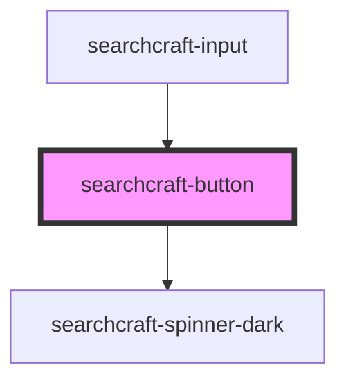

# sc-button

<!-- Auto Generated Below -->

## Properties

| Property       | Attribute       | Description | Type      | Default     |
| -------------- | --------------- | ----------- | --------- | ----------- |
| `iconElement`  | --              |             | `Element` | `undefined` |
| `iconOnly`     | `icon-only`     |             | `boolean` | `false`     |
| `iconPosition` | `icon-position` |             | `string`  | `'left'`    |
| `label`        | `label`         |             | `string`  | `'Search'`  |

## Events

| Event         | Description | Type                |
| ------------- | ----------- | ------------------- |
| `buttonClick` |             | `CustomEvent<void>` |

## Dependencies

### Used by

 - [searchcraft-input](../searchcraft-input)

### Depends on

- [searchcraft-spinner-dark](../searchcraft-spinner-dark)

### Graph

----------------------------------------------

*Built with [StencilJS](https://stenciljs.com/)*
