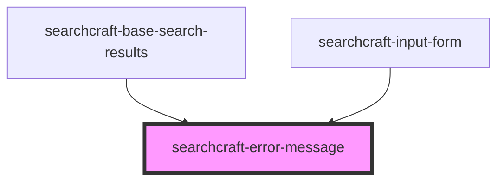

# sc-error-message


<!-- Auto Generated Below -->


## Overview

This web component is designed to display a user-friendly error message when a search query fails, providing clear feedback to users and enhancing their experience when an issue arises during the search process.

## Usage
```html
<!-- index.html -->
<searchcraft-error-message error-message="No search results found for query" />
```

## Properties

| Property       | Attribute       | Description        | Type     | Default     |
| -------------- | --------------- | ------------------ | -------- | ----------- |
| `errorMessage` | `error-message` | The error message. | `string` | `undefined` |


## Dependencies

### Used by

 - [searchcraft-base-search-results](../searchcraft-base-search-results)
 - [searchcraft-input-form](../searchcraft-input-form)

### Graph


----------------------------------------------

*Built with [StencilJS](https://stenciljs.com/)*
