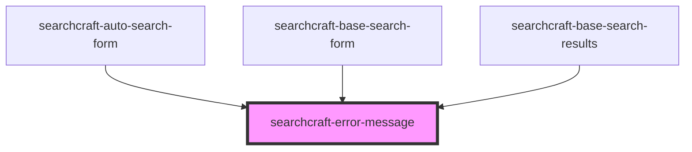

# sc-error-message

<!-- Auto Generated Below -->

## Properties

| Property       | Attribute       | Description | Type                | Default     |
| -------------- | --------------- | ----------- | ------------------- | ----------- |
| `errorMessage` | `error-message` |             | `string`            | `undefined` |
| `theme`        | `theme`         |             | `"dark" \| "light"` | `'light'`   |

## Dependencies

### Used by

 - [searchcraft-auto-search-form](../searchcraft-auto-search-form)
 - [searchcraft-base-search-form](../searchcraft-base-search-form)
 - [searchcraft-base-search-results](../searchcraft-base-search-results)

### Graph

----------------------------------------------

*Built with [StencilJS](https://stenciljs.com/)*
