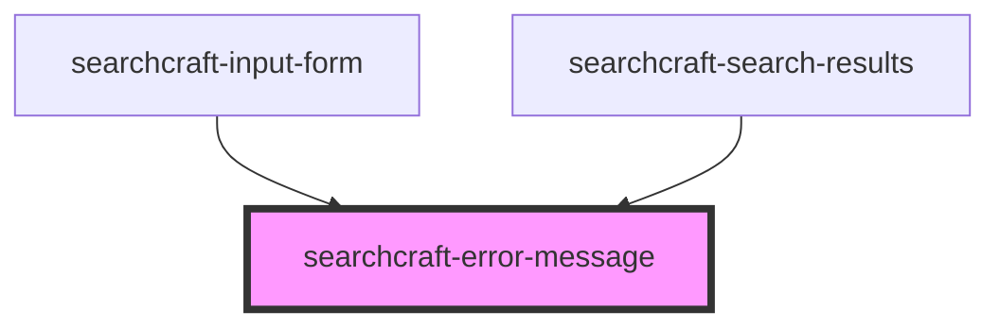

# sc-error-message


<!-- Auto Generated Below -->


## Overview

This web component is designed to display a user-friendly error message when a search query fails, providing clear feedback to users and enhancing their experience when an issue arises during the search process.

## Usage
```html
<!-- index.html -->
<searchcraft-error-message>
  No search results found for query
</searchcraft-error-message>
```

## Dependencies

### Used by

 - [searchcraft-input-form](../searchcraft-input-form)
 - [searchcraft-search-results](../searchcraft-search-results)

### Graph


----------------------------------------------

*Built with [StencilJS](https://stenciljs.com/)*
