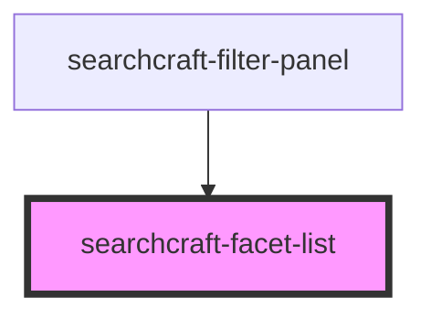

# searchcraft-filters-list


<!-- Auto Generated Below -->


## Overview

This web component is designed to display facets in a search interface, allowing users to refine their search results by applying filters based on various attributes.
It is consumed within the `searchcraft-filter-panel`.

## Usage
```html
<!-- index.html -->
<searchcraft-facet-list field-name="title" />
```

```js
// index.js
const facetList = document.querySelector('searchcraft-facet-list');

facetList.addEventListener('facetSelectionUpdated', () => {
  console.log('Facet selection updated');
});
```

## Properties

| Property    | Attribute    | Description                                     | Type     | Default     |
| ----------- | ------------ | ----------------------------------------------- | -------- | ----------- |
| `fieldName` | `field-name` | The name of the field where facets are applied. | `string` | `undefined` |


## Events

| Event                   | Description                  | Type                                |
| ----------------------- | ---------------------------- | ----------------------------------- |
| `facetSelectionUpdated` | When the facets are updated. | `CustomEvent<{ paths: string[]; }>` |


## Dependencies

### Used by

 - [searchcraft-filter-panel](../searchcraft-filter-panel)

### Graph


----------------------------------------------

*Built with [StencilJS](https://stenciljs.com/)*
