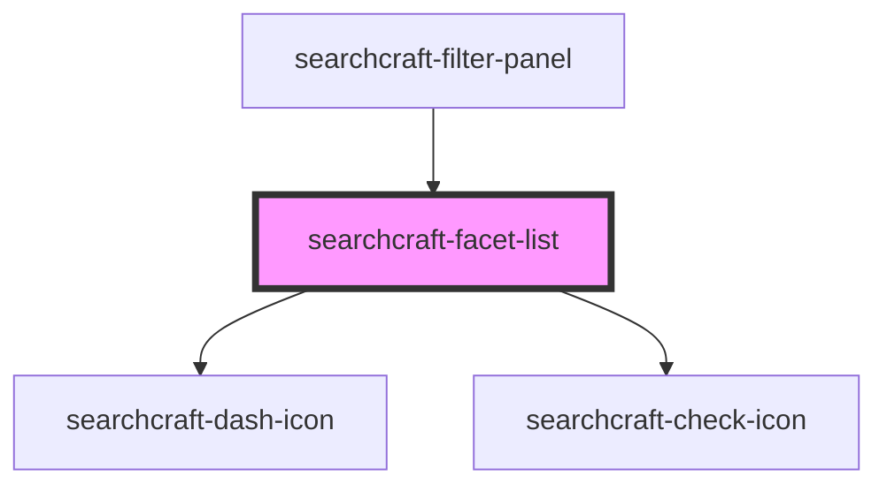

# searchcraft-filters-list

<!-- Auto Generated Below -->

## Properties

| Property    | Attribute    | Description | Type     | Default     |
| ----------- | ------------ | ----------- | -------- | ----------- |
| `fieldName` | `field-name` |             | `string` | `undefined` |

## Events

| Event                   | Description | Type                                |
| ----------------------- | ----------- | ----------------------------------- |
| `facetSelectionUpdated` |             | `CustomEvent<{ paths: string[]; }>` |

## Dependencies

### Used by

 - [searchcraft-filter-panel](../searchcraft-filter-panel)

### Depends on

- [searchcraft-dash-icon](../../assets)
- [searchcraft-check-icon](../../assets)

### Graph

----------------------------------------------

*Built with [StencilJS](https://stenciljs.com/)*
