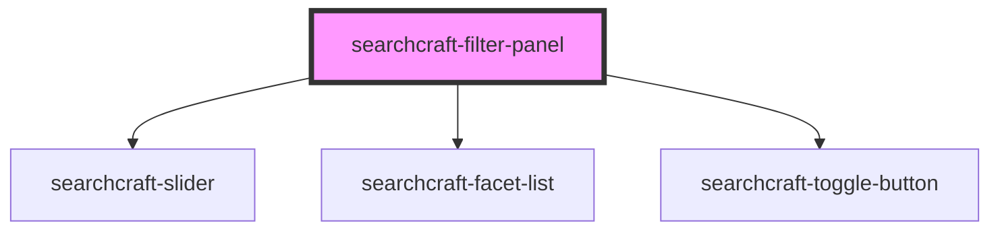

# searchcraft-filter-panel


<!-- Auto Generated Below -->


## Overview

This web component represents a series of filters that allows users to refine and control their search queries by applying various filter criteria.

## Usage
```html
<!-- index.html -->
<searchcraft-filter-panel />
```

## Properties

| Property | Attribute | Description          | Type           | Default |
| -------- | --------- | -------------------- | -------------- | ------- |
| `items`  | --        | The items to filter. | `FilterItem[]` | `[]`    |


## Dependencies

### Depends on

- [searchcraft-slider](../searchcraft-slider)
- [searchcraft-facet-list](../searchcraft-facet-list)
- [searchcraft-toggle-button](../searchcraft-toggle-button)

### Graph


----------------------------------------------

*Built with [StencilJS](https://stenciljs.com/)*
