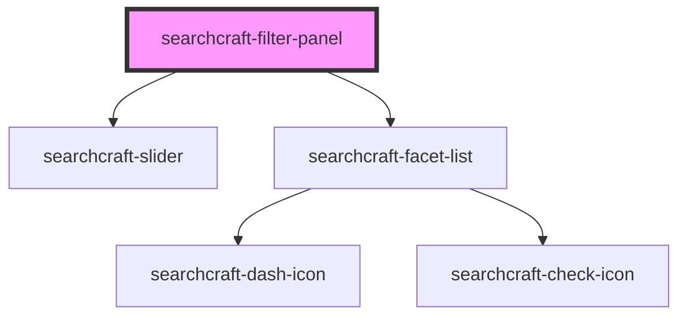

# searchcraft-filter-panel

<!-- Auto Generated Below -->

## Properties

| Property      | Attribute | Description | Type           | Default |
| ------------- | --------- | ----------- | -------------- | ------- |
| `filterItems` | --        |             | `FilterItem[]` | `[]`    |

## Events

| Event    | Description                                      | Type                    |
| -------- | ------------------------------------------------ | ----------------------- |
| `update` | Emits an event with an array of query ctx values | `CustomEvent<string[]>` |

## Dependencies

### Depends on

- [searchcraft-slider](../searchcraft-slider)
- [searchcraft-facet-list](../searchcraft-facet-list)

### Graph

----------------------------------------------

*Built with [StencilJS](https://stenciljs.com/)*
