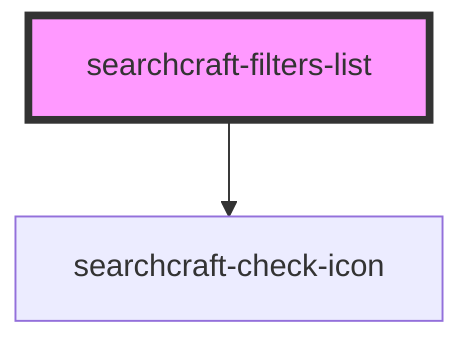

# searchcraft-filters-list

<!-- Auto Generated Below -->

## Properties

| Property  | Attribute | Description | Type                                  | Default |
| --------- | --------- | ----------- | ------------------------------------- | ------- |
| `filters` | --        |             | `{ label: string; value: string; }[]` | `[]`    |

## Events

| Event            | Description | Type                    |
| ---------------- | ----------- | ----------------------- |
| `filtersUpdated` |             | `CustomEvent<string[]>` |

## Dependencies

### Depends on

- [searchcraft-check-icon](../../assets)

### Graph

----------------------------------------------

*Built with [StencilJS](https://stenciljs.com/)*
