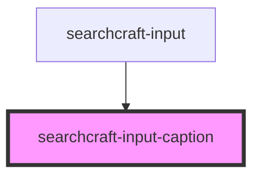

# sc-input-caption

<!-- Auto Generated Below -->

## Properties

| Property                 | Attribute                   | Description | Type      | Default          |
| ------------------------ | --------------------------- | ----------- | --------- | ---------------- |
| `error`                  | `error`                     |             | `boolean` | `undefined`      |
| `inputCaptionClassName`  | `input-caption-class-name`  |             | `string`  | `''`             |
| `inputCaptionValue`      | `input-caption-value`       |             | `string`  | `'Enter Search'` |
| `rightToLeftOrientation` | `right-to-left-orientation` |             | `boolean` | `false`          |

## Dependencies

### Used by

 - [searchcraft-input](../searchcraft-input)

### Graph

----------------------------------------------

*Built with [StencilJS](https://stenciljs.com/)*
