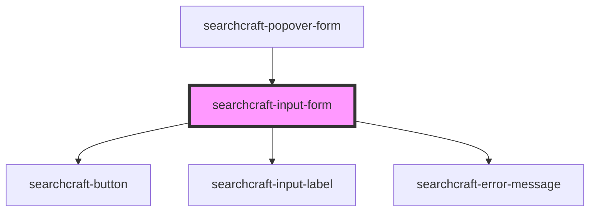

# sc-input


<!-- Auto Generated Below -->


## Overview

This web component provides a user-friendly interface for querying an indexed dataset, enabling users to easily search large collections of data.
It abstracts the complexities of index-based searching, making it accessible to users of all technical levels.

## Usage
```html
<!-- index.html -->
<searchcraft-input-form placeholder-value="Search here" />
```

## Properties

| Property           | Attribute           | Description                                                                    | Type                                       | Default          |
| ------------------ | ------------------- | ------------------------------------------------------------------------------ | ------------------------------------------ | ---------------- |
| `autoSearch`       | `auto-search`       | Whether or not to automatically submit the search term when the input changes. | `boolean \| undefined`                     | `true`           |
| `buttonLabel`      | `button-label`      | The label for the submit button.                                               | `string \| undefined`                      | `undefined`      |
| `buttonPlacement`  | `button-placement`  | Where to place the search button.                                              | `"left" \| "none" \| "right" \| undefined` | `'none'`         |
| `core`             | --                  |                                                                                | `SearchcraftCore \| undefined`             | `undefined`      |
| `inputLabel`       | `input-label`       | The label rendered above the input.                                            | `string \| undefined`                      | `undefined`      |
| `placeholderValue` | `placeholder-value` | The input element's placeholder value.                                         | `string \| undefined`                      | `'Enter Search'` |


## Events

| Event        | Description                           | Type                |
| ------------ | ------------------------------------- | ------------------- |
| `inputBlur`  | When the input becomes unfocused.     | `CustomEvent<void>` |
| `inputFocus` | When the input becomes focused.       | `CustomEvent<void>` |
| `inputInit`  | Event emitted when input initializes. | `CustomEvent<void>` |


## Dependencies

### Used by

 - [searchcraft-popover-form](../searchcraft-popover-form)

### Depends on

- [searchcraft-button](../searchcraft-button)
- [searchcraft-input-label](../searchcraft-input-label)
- [searchcraft-error-message](../searchcraft-error-message)

### Graph


----------------------------------------------

*Built with [StencilJS](https://stenciljs.com/)*
