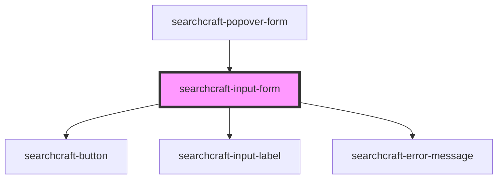

# sc-input


<!-- Auto Generated Below -->


## Overview

This web component provides a user-friendly interface for querying an indexed dataset, enabling users to easily search large collections of data.
It abstracts the complexities of index-based searching, making it accessible to users of all technical levels.

## Usage
```html
<!-- index.html -->
<searchcraft-input-form placeholder-value="Search here" />
```

```js
// index.js
const searchInputForm = document.querySelector('searchcraft-input-form');

searchInputForm.config = {
  index: [],
  readKey: '',
  endpointUrl: '',
};

searchForm.addEventListener('querySubmit', (event) => {
  console.log('Query submitted', event.detail);
});
```

## Properties

| Property           | Attribute           | Description                                                                    | Type                                 | Default          |
| ------------------ | ------------------- | ------------------------------------------------------------------------------ | ------------------------------------ | ---------------- |
| `autoSearch`       | `auto-search`       | Whether or not to automatically submit the search term when the input changes. | `boolean`                            | `true`           |
| `buttonLabel`      | `button-label`      | The label for the submit button.                                               | `string \| undefined`                | `undefined`      |
| `buttonPlacement`  | `button-placement`  | Where to place the search button.                                              | `"left" \| "none" \| "right"`        | `'none'`         |
| `config`           | --                  | The Searchcraft config object.                                                 | `SearchcraftConfig \| undefined`     | `undefined`      |
| `customStyles`     | `custom-styles`     | A custom styles object to be applied to the input element.                     | `string \| { [x: string]: string; }` | `{}`             |
| `inputLabel`       | `input-label`       | The label rendered above the input.                                            | `string \| undefined`                | `undefined`      |
| `placeholderValue` | `placeholder-value` | The input element's placeholder value.                                         | `string`                             | `'Enter Search'` |
| `searchTerm`       | `search-term`       | The starting value of the input element.                                       | `string`                             | `''`             |


## Events

| Event               | Description                                    | Type                  |
| ------------------- | ---------------------------------------------- | --------------------- |
| `inputBlur`         | When the input becomes unfocused.              | `CustomEvent<void>`   |
| `inputCleared`      | When the input is cleared.                     | `CustomEvent<void>`   |
| `inputFocus`        | When the input becomes focused.                | `CustomEvent<void>`   |
| `inputInit`         | Event emitted when input initializes.          | `CustomEvent<void>`   |
| `noResultsReceived` | When no results are returned.                  | `CustomEvent<void>`   |
| `querySubmit`       | Event emitted when a query has been submitted. | `CustomEvent<string>` |


## Dependencies

### Used by

 - [searchcraft-popover-form](../searchcraft-popover-form)

### Depends on

- [searchcraft-button](../searchcraft-button)
- [searchcraft-input-label](../searchcraft-input-label)
- [searchcraft-error-message](../searchcraft-error-message)

### Graph


----------------------------------------------

*Built with [StencilJS](https://stenciljs.com/)*
