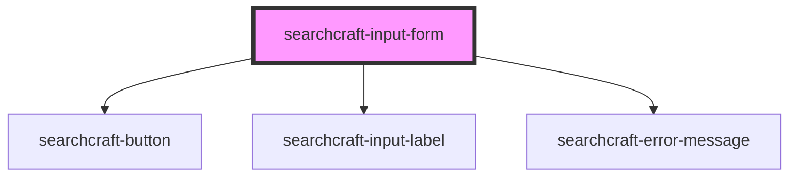

# sc-input

<!-- Auto Generated Below -->

## Properties

| Property           | Attribute           | Description                                                                    | Type                                 | Default          |
| ------------------ | ------------------- | ------------------------------------------------------------------------------ | ------------------------------------ | ---------------- |
| `autoSearch`       | `auto-search`       | Whether or not to automatically submit the search term when the input changes. | `boolean`                            | `true`           |
| `buttonLabel`      | `button-label`      | The label for the submit button.                                               | `string`                             | `undefined`      |
| `buttonPlacement`  | `button-placement`  | Where to place the search button.                                              | `"left" \| "none" \| "right"`        | `'none'`         |
| `config`           | --                  | The Searchcraft config object.                                                 | `SearchcraftConfig`                  | `undefined`      |
| `customStyles`     | `custom-styles`     | A custom styles object to be applied to the input element.                     | `string \| { [x: string]: string; }` | `{}`             |
| `debounceDelay`    | `debounce-delay`    | The duration to debounce the input's `inputChange` event.                      | `number`                             | `0`              |
| `inputLabel`       | `input-label`       | The label rendered above the input.                                            | `string`                             | `undefined`      |
| `placeholderValue` | `placeholder-value` | The input element's placeholder value.                                         | `string`                             | `'Enter Search'` |
| `searchTerm`       | `search-term`       | The starting value of the input element.                                       | `string`                             | `''`             |

## Events

| Event               | Description                                                  | Type                  |
| ------------------- | ------------------------------------------------------------ | --------------------- |
| `inputBlur`         | Event emitted when the input has lost focus.                 | `CustomEvent<void>`   |
| `inputCleared`      | Event emitted when the input element has been cleared.       | `CustomEvent<void>`   |
| `inputFocus`        | Event emitted when the input has gained focus.               | `CustomEvent<void>`   |
| `noResultsReceived` | Event emitted when a query returns with no results received. | `CustomEvent<void>`   |
| `querySubmit`       | Event emitted when a new search request has been submitted.  | `CustomEvent<string>` |

## Dependencies

### Depends on

- [searchcraft-button](../searchcraft-button)
- [searchcraft-input-label](../searchcraft-input-label)
- [searchcraft-error-message](../searchcraft-error-message)

### Graph

----------------------------------------------

*Built with [StencilJS](https://stenciljs.com/)*
