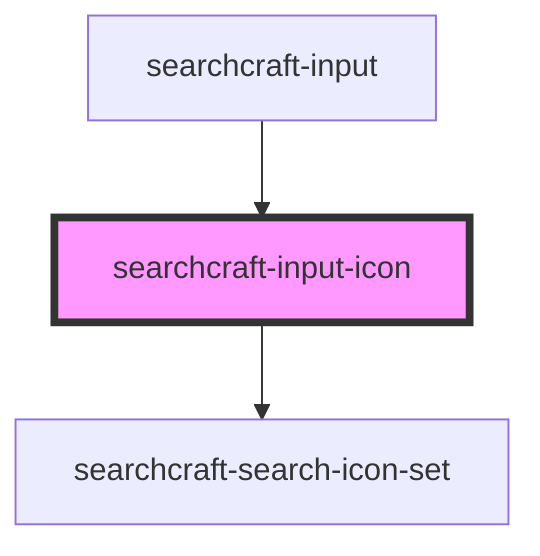

# sc-input-icon

<!-- Auto Generated Below -->

## Properties

| Property                 | Attribute                   | Description                                       | Type      | Default     |
| ------------------------ | --------------------------- | ------------------------------------------------- | --------- | ----------- |
| `error`                  | `error`                     | Determines if an error icon should be displayed.  | `boolean` | `undefined` |
| `height`                 | `height`                    |                                                   | `number`  | `20`        |
| `rightToLeftOrientation` | `right-to-left-orientation` | Determines if the layout should be right-to-left. | `boolean` | `false`     |
| `width`                  | `width`                     |                                                   | `number`  | `20`        |

## Dependencies

### Used by

 - [searchcraft-input](../searchcraft-input)

### Depends on

- [searchcraft-search-icon-set](../../assets)

### Graph

----------------------------------------------

*Built with [StencilJS](https://stenciljs.com/)*
