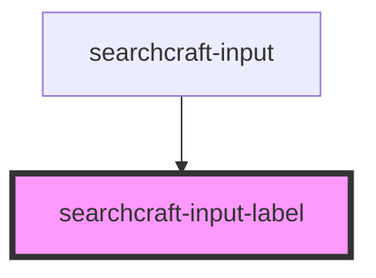

# sc-input-label

<!-- Auto Generated Below -->

## Properties

| Property              | Attribute                | Description | Type     | Default     |
| --------------------- | ------------------------ | ----------- | -------- | ----------- |
| `inputLabelClassName` | `input-label-class-name` |             | `string` | `''`        |
| `label`               | `label`                  |             | `string` | `undefined` |

## Dependencies

### Used by

 - [searchcraft-input](../searchcraft-input)

### Graph

----------------------------------------------

*Built with [StencilJS](https://stenciljs.com/)*
