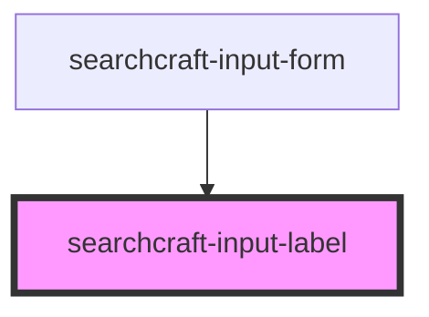

# sc-input-label


<!-- Auto Generated Below -->


## Overview

This web component serves as the input label for the searchcraft-input-form component.

## Usage
```html
<!-- index.html -->
<searchcraft-input-label label="Search" />
```

## Properties

| Property              | Attribute                | Description                                 | Type                  | Default |
| --------------------- | ------------------------ | ------------------------------------------- | --------------------- | ------- |
| `inputLabelClassName` | `input-label-class-name` | The classname applied to the label element. | `string \| undefined` | `''`    |
| `label`               | `label`                  |                                             | `string`              | `''`    |


## Dependencies

### Used by

 - [searchcraft-input-form](../searchcraft-input-form)

### Graph


----------------------------------------------

*Built with [StencilJS](https://stenciljs.com/)*
