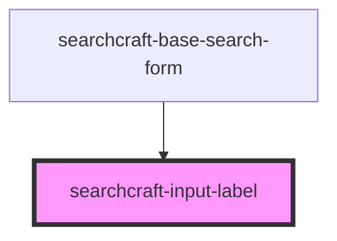

# sc-input-label

<!-- Auto Generated Below -->

## Properties

| Property              | Attribute                | Description | Type     | Default          |
| --------------------- | ------------------------ | ----------- | -------- | ---------------- |
| `inputLabelClassName` | `input-label-class-name` |             | `string` | `''`             |
| `label`               | `label`                  |             | `string` | `'Enter Search'` |

## Dependencies

### Used by

 - [searchcraft-base-search-form](../searchcraft-base-search-form)

### Graph

----------------------------------------------

*Built with [StencilJS](https://stenciljs.com/)*
