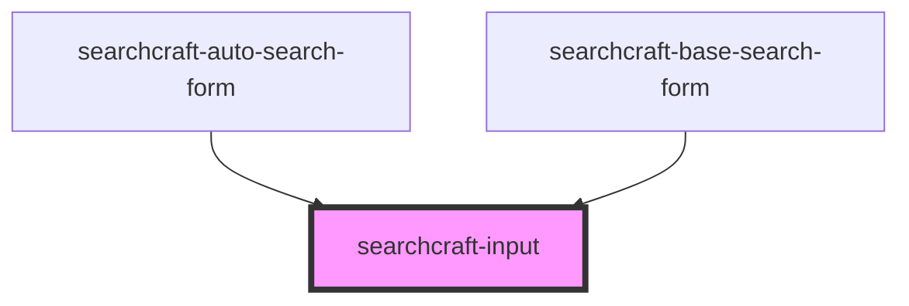

# sc-input

<!-- Auto Generated Below -->

## Properties

| Property                | Attribute                  | Description | Type                                 | Default          |
| ----------------------- | -------------------------- | ----------- | ------------------------------------ | ---------------- |
| `customStyles`          | `custom-styles`            |             | `string \| { [x: string]: string; }` | `{}`             |
| `error`                 | `error`                    |             | `boolean`                            | `false`          |
| `inputCaptionClassName` | `input-caption-class-name` |             | `string`                             | `''`             |
| `inputCaptionValue`     | `input-caption-value`      |             | `string`                             | `''`             |
| `inputClassName`        | `input-class-name`         |             | `string`                             | `''`             |
| `inputIconSize`         | `input-icon-size`          |             | `number`                             | `20`             |
| `isRequesting`          | `is-requesting`            |             | `boolean`                            | `false`          |
| `placeholderValue`      | `placeholder-value`        |             | `string`                             | `'Enter Search'` |
| `query`                 | `query`                    |             | `string`                             | `''`             |

## Events

| Event               | Description | Type                  |
| ------------------- | ----------- | --------------------- |
| `clearInput`        |             | `CustomEvent<void>`   |
| `inputKeyUp`        |             | `CustomEvent<string>` |
| `searchInputChange` |             | `CustomEvent<string>` |

## Dependencies

### Used by

 - [searchcraft-auto-search-form](../searchcraft-auto-search-form)
 - [searchcraft-base-search-form](../searchcraft-base-search-form)

### Graph

----------------------------------------------

*Built with [StencilJS](https://stenciljs.com/)*
