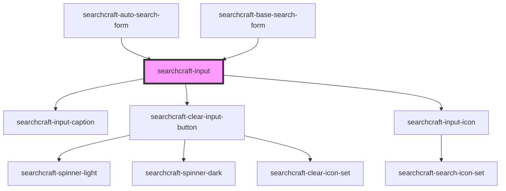

# sc-input

<!-- Auto Generated Below -->

## Properties

| Property                 | Attribute                   | Description | Type                                 | Default          |
| ------------------------ | --------------------------- | ----------- | ------------------------------------ | ---------------- |
| `customStyles`           | `custom-styles`             |             | `string \| { [x: string]: string; }` | `{}`             |
| `error`                  | `error`                     |             | `boolean`                            | `false`          |
| `formClassName`          | `form-class-name`           |             | `string`                             | `''`             |
| `inputCaptionClassName`  | `input-caption-class-name`  |             | `string`                             | `''`             |
| `inputCaptionValue`      | `input-caption-value`       |             | `string`                             | `''`             |
| `inputClassName`         | `input-class-name`          |             | `string`                             | `''`             |
| `inputIconHeight`        | `input-icon-height`         |             | `number`                             | `20`             |
| `inputIconWidth`         | `input-icon-width`          |             | `number`                             | `20`             |
| `isRequesting`           | `is-requesting`             |             | `boolean`                            | `false`          |
| `placeholderValue`       | `placeholder-value`         |             | `string`                             | `'Enter Search'` |
| `query`                  | `query`                     |             | `string`                             | `''`             |
| `rightToLeftOrientation` | `right-to-left-orientation` |             | `boolean`                            | `false`          |

## Events

| Event               | Description | Type                  |
| ------------------- | ----------- | --------------------- |
| `clearInput`        |             | `CustomEvent<void>`   |
| `searchInputChange` |             | `CustomEvent<string>` |

## Dependencies

### Used by

 - [searchcraft-auto-search-form](../searchcraft-auto-search-form)
 - [searchcraft-base-search-form](../searchcraft-base-search-form)

### Depends on

- [searchcraft-input-caption](../searchcraft-input-caption)
- [searchcraft-clear-input-button](../searchcraft-clear-input-button)
- [searchcraft-input-icon](../searchcraft-input-icon)

### Graph

----------------------------------------------

*Built with [StencilJS](https://stenciljs.com/)*
