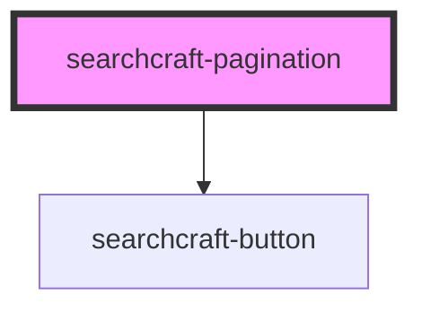

# searchcraft-pagination


<!-- Auto Generated Below -->


## Overview

This web component is designed to facilitate pagination of search results.
Once a query is submitted, calculates the number for pages.

## Usage
```html
<!-- index.html -->
<searchcraft-pagination />
```

## Dependencies

### Depends on

- [searchcraft-button](../searchcraft-button)

### Graph


----------------------------------------------

*Built with [StencilJS](https://stenciljs.com/)*
