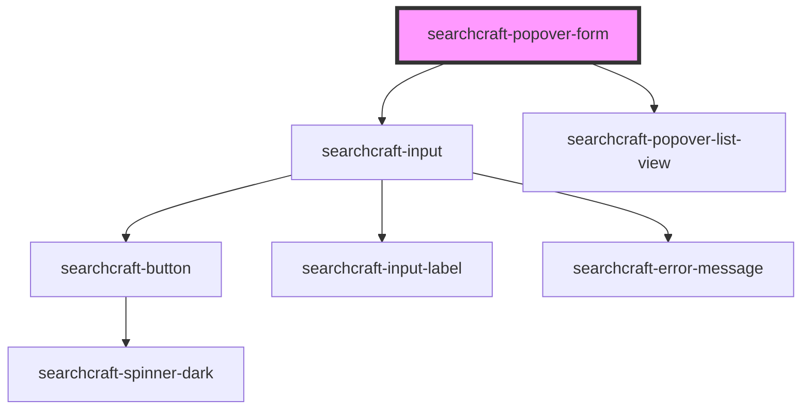

# searchcraft-popover-form

<!-- Auto Generated Below -->

## Properties

| Property                | Attribute | Description | Type                                                                                                                              | Default     |
| ----------------------- | --------- | ----------- | --------------------------------------------------------------------------------------------------------------------------------- | ----------- |
| `config`                | --        |             | `SearchcraftConfig`                                                                                                               | `undefined` |
| `popoverResultMappings` | --        |             | `{ title?: SearchResultMapping; subtitle?: SearchResultMapping; imageSource?: SearchResultMapping; href?: SearchResultMapping; }` | `undefined` |
| `type`                  | `type`    |             | `"fullscreen" \| "inline" \| "modal"`                                                                                             | `'inline'`  |

## Dependencies

### Depends on

- [searchcraft-input](../searchcraft-input)
- [searchcraft-popover-list-view](../searchcraft-popover-list-view)

### Graph

----------------------------------------------

*Built with [StencilJS](https://stenciljs.com/)*
