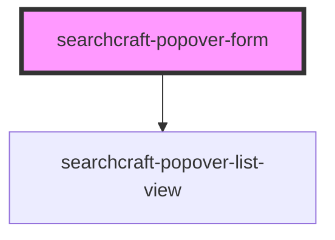

# searchcraft-popover-form


<!-- Auto Generated Below -->


## Overview

This web component is designed to display search results in a popover container that dynamically appears when the user interacts with a search input field.

## Usage
```html
<!-- index.html -->
<searchcraft-popover-form type="fullscreen" />
```

```js
// index.js
const popoverForm = document.querySelector('searchcraft-popover-form');

popoverForm.config = {
  index: [],
  readKey: '',
  endpointUrl: '',
};

popoverForm.popoverResultMappings = containerHref: {
  fieldNames: [
   {
     fieldName: 'canonical_link',
     dataType: 'text',
   },
 ],
};
```

## Properties

| Property                | Attribute | Description                                   | Type                                                                                                                              | Default     |
| ----------------------- | --------- | --------------------------------------------- | --------------------------------------------------------------------------------------------------------------------------------- | ----------- |
| `config`                | --        | The Searchcraft config object.                | `SearchcraftConfig`                                                                                                               | `undefined` |
| `popoverResultMappings` | --        | Formats the content rendered for each result. | `{ title?: SearchResultMapping; subtitle?: SearchResultMapping; imageSource?: SearchResultMapping; href?: SearchResultMapping; }` | `undefined` |
| `type`                  | `type`    | How the element is displayed.                 | `"fullscreen" \| "inline" \| "modal"`                                                                                             | `'inline'`  |


## Dependencies

### Depends on

- [searchcraft-popover-list-view](../searchcraft-popover-list-view)

### Graph


----------------------------------------------

*Built with [StencilJS](https://stenciljs.com/)*
