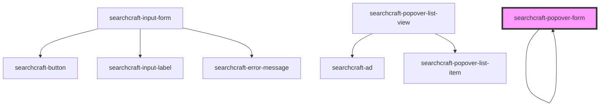

# searchcraft-popover-form


<!-- Auto Generated Below -->


## Overview

This web component is designed to display search results in a popover container that dynamically appears when the user interacts with a search input field, or when a popover-button is pressed.

## Usage
```html
<!-- index.html -->
<searchcraft-popover-form type="fullscreen" />
```

```js
// index.js
const popoverForm = document.querySelector('searchcraft-popover-form');

popoverForm.popoverResultMappings = {
 containerHref: {
  fieldNames: [
   {
     fieldName: 'canonical_link',
     dataType: 'text',
   },
 ],
 };
```

## Properties

| Property                | Attribute         | Description                                                                                                                                                                                                                                                                                                                                                              | Type                                                                                                                                                                                                                                            | Default     |
| ----------------------- | ----------------- | ------------------------------------------------------------------------------------------------------------------------------------------------------------------------------------------------------------------------------------------------------------------------------------------------------------------------------------------------------------------------ | ----------------------------------------------------------------------------------------------------------------------------------------------------------------------------------------------------------------------------------------------- | ----------- |
| `hotkey`                | `hotkey`          | The hotkey that activates the popover.                                                                                                                                                                                                                                                                                                                                   | `string \| undefined`                                                                                                                                                                                                                           | `'k'`       |
| `hotkeyModifier`        | `hotkey-modifier` | The hotkey modifier that activates the popover. Used together with the `hotkey` prop.                                                                                                                                                                                                                                                                                    | `"alt" \| "ctrl" \| "meta" \| "option" \| undefined`                                                                                                                                                                                            | `'meta'`    |
| `popoverResultMappings` | --                | Formats the content rendered for each result.                                                                                                                                                                                                                                                                                                                            | `undefined \| { title?: SearchResultMapping \| undefined; subtitle?: SearchResultMapping \| undefined; imageSource?: SearchResultMapping \| undefined; imageAlt?: SearchResultMapping \| undefined; href?: SearchResultMapping \| undefined; }` | `undefined` |
| `type`                  | `type`            | The type of popover form to render.  - `inline` - Renders inline with the rest of the content on the page. The search results pop over the page content. - `fullscreen` - Renders in fullscreen view. Used together with the `searchcraft-popover-button` component. - `modal` - Renders in a modal view. Used together with the `searchcraft-popover-button` component. | `"fullscreen" \| "inline" \| "modal" \| undefined`                                                                                                                                                                                              | `'inline'`  |


## Dependencies

### Used by

 - [searchcraft-popover-form](.)

### Depends on

- [searchcraft-popover-form](.)
- [searchcraft-input-form](../searchcraft-input-form)
- [searchcraft-popover-list-view](../searchcraft-popover-list-view)

### Graph


----------------------------------------------

*Built with [StencilJS](https://stenciljs.com/)*
