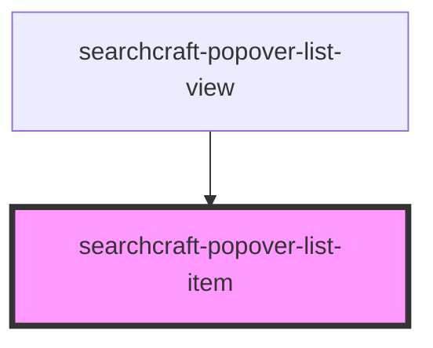

# searchcraft-popover-result

<!-- Auto Generated Below -->

## Overview

A single list item rendered in a searchcraft-popover-list-view.

## Properties

| Property                | Attribute           | Description                                                        | Type                                                                                                                                                                                                                                            | Default     |
| ----------------------- | ------------------- | ------------------------------------------------------------------ | ----------------------------------------------------------------------------------------------------------------------------------------------------------------------------------------------------------------------------------------------- | ----------- |
| `documentPosition`      | `document-position` | The document position relative to the search results (For Measure) | `number`                                                                                                                                                                                                                                        | `0`         |
| `item`                  | --                  |                                                                    | `SearchClientResponseItem \| undefined`                                                                                                                                                                                                         | `undefined` |
| `popoverResultMappings` | --                  |                                                                    | `undefined \| { title?: SearchResultMapping \| undefined; subtitle?: SearchResultMapping \| undefined; imageSource?: SearchResultMapping \| undefined; imageAlt?: SearchResultMapping \| undefined; href?: SearchResultMapping \| undefined; }` | `undefined` |

## Dependencies

### Used by

 - [searchcraft-popover-list-view](../searchcraft-popover-list-view)

### Graph

----------------------------------------------

*Built with [StencilJS](https://stenciljs.com/)*
