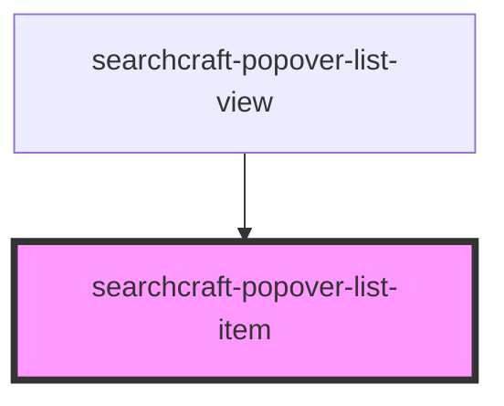

# searchcraft-popover-result

<!-- Auto Generated Below -->

## Overview

A single list item rendered in a searchcraft-popover-list-view.

## Properties

| Property           | Attribute           | Description                                                         | Type                  | Default     |
| ------------------ | ------------------- | ------------------------------------------------------------------- | --------------------- | ----------- |
| `documentPosition` | `document-position` | The document position relative to the search results (For Measure)  | `number`              | `0`         |
| `href`             | `href`              | The link href                                                       | `string \| undefined` | `undefined` |
| `imageAlt`         | `image-alt`         | The image alt tag.                                                  | `string \| undefined` | `undefined` |
| `imageSrc`         | `image-src`         | The source of the image. If not included, no item will be rendered. | `string \| undefined` | `undefined` |
| `subtitleContent`  | `subtitle-content`  | The result subtitle                                                 | `string \| undefined` | `undefined` |
| `titleContent`     | `title-content`     | The result title                                                    | `string \| undefined` | `undefined` |

## Dependencies

### Used by

 - [searchcraft-popover-list-view](../searchcraft-popover-list-view)

### Graph

----------------------------------------------

*Built with [StencilJS](https://stenciljs.com/)*
