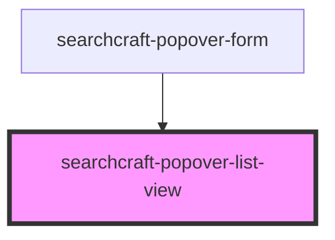

# searchcraft-popover-results


<!-- Auto Generated Below -->


## Overview

This web component is designed to display a list of results within a popover interface.
It is consumed within the `searchcraft-popover-form` component.

## Usage
```html
<!-- index.html -->
<searchcraft-popover-list-view />
```

## Properties

| Property                | Attribute | Description                                   | Type                                                                                                                              | Default     |
| ----------------------- | --------- | --------------------------------------------- | --------------------------------------------------------------------------------------------------------------------------------- | ----------- |
| `popoverResultMappings` | --        | Formats the content rendered for each result. | `{ title?: SearchResultMapping; subtitle?: SearchResultMapping; imageSource?: SearchResultMapping; href?: SearchResultMapping; }` | `undefined` |


## Dependencies

### Used by

 - [searchcraft-popover-form](../searchcraft-popover-form)

### Graph


----------------------------------------------

*Built with [StencilJS](https://stenciljs.com/)*
