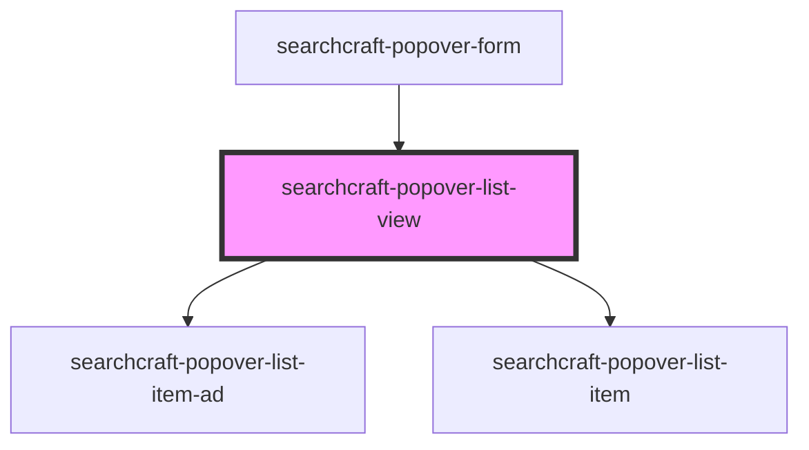

# searchcraft-popover-results


<!-- Auto Generated Below -->


## Overview

This web component is designed to display a list of results within a popover interface.
It is consumed within the `searchcraft-popover-form` component.

## Usage
```html
<!-- index.html -->
<searchcraft-popover-list-view />
```

## Properties

| Property                            | Attribute                 | Description                                                                                       | Type                                                                                                                                                                                                                                            | Default     |
| ----------------------------------- | ------------------------- | ------------------------------------------------------------------------------------------------- | ----------------------------------------------------------------------------------------------------------------------------------------------------------------------------------------------------------------------------------------------- | ----------- |
| `adClientResponseItems`             | --                        |                                                                                                   | `AdClientResponseItem[] \| undefined`                                                                                                                                                                                                           | `undefined` |
| `popoverResultMappings`             | --                        | The mappings that define how the data in the documents are mapped to the list-view-item elements. | `undefined \| { title?: SearchResultMapping \| undefined; subtitle?: SearchResultMapping \| undefined; imageSource?: SearchResultMapping \| undefined; imageAlt?: SearchResultMapping \| undefined; href?: SearchResultMapping \| undefined; }` | `undefined` |
| `searchClientResponseItems`         | --                        | The items to render in the list view.                                                             | `SearchClientResponseItem[] \| undefined`                                                                                                                                                                                                       | `undefined` |
| `searchResultsPage` _(required)_    | `search-results-page`     |                                                                                                   | `number`                                                                                                                                                                                                                                        | `undefined` |
| `searchResultsPerPage` _(required)_ | `search-results-per-page` |                                                                                                   | `number`                                                                                                                                                                                                                                        | `undefined` |


## Dependencies

### Used by

 - [searchcraft-popover-form](../searchcraft-popover-form)

### Depends on

- [searchcraft-popover-list-item-ad](../searchcraft-popover-list-item-ad)
- [searchcraft-popover-list-item](../searchcraft-popover-list-item)

### Graph


----------------------------------------------

*Built with [StencilJS](https://stenciljs.com/)*
