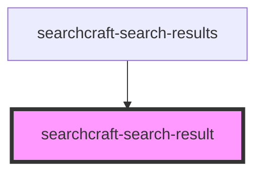

# searchcraft-search-result

<!-- Auto Generated Below -->

## Overview

This web component is designed to display detailed information for a single search result.
Once a query is submitted, the component formats and presents the result.
It is consumed within the `searchcraft-search-results` component.

## Properties

| Property             | Attribute           | Description                                                                   | Type                                                                                  | Default     |
| -------------------- | ------------------- | ----------------------------------------------------------------------------- | ------------------------------------------------------------------------------------- | ----------- |
| `documentPosition`   | `document-position` | The position in the document. Used with the "document_clicked" measure event. | `number`                                                                              | `0`         |
| `index` _(required)_ | `index`             | The index.                                                                    | `number`                                                                              | `undefined` |
| `item`               | --                  |                                                                               | `SearchClientResponseItem \| undefined`                                               | `undefined` |
| `template`           | --                  | A callback function responsible for rendering a result.                       | `((data: any, index: number, utils: { html: TemplateHtml; }) => string) \| undefined` | `undefined` |

## Dependencies

### Used by

 - [searchcraft-search-results](../searchcraft-search-results)

### Graph

----------------------------------------------

*Built with [StencilJS](https://stenciljs.com/)*
