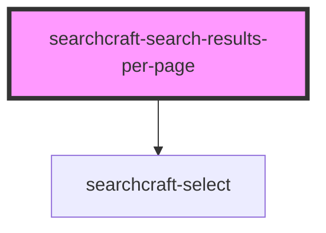

# searchcraft-search-results-per-page


<!-- Auto Generated Below -->


## Overview

This web component is designed to choose the number of search results displayed.

## Usage
```html
<!-- index.html -->
<searchcraft-search-results-per-page increment="20" />
```

## Properties

| Property       | Attribute       | Description                                                                                                                                                  | Type                  | Default     |
| -------------- | --------------- | ------------------------------------------------------------------------------------------------------------------------------------------------------------ | --------------------- | ----------- |
| `customStyles` | `custom-styles` | The custom styles object.                                                                                                                                    | `string \| undefined` | `undefined` |
| `increment`    | `increment`     | The amount the options will increase (e.g. 20 = [20, 40, 60, 80, 100]). The base value is defined by the `searchResultsPerPage` option in the configuration. | `number \| string`    | `20`        |


## Dependencies

### Depends on

- [searchcraft-select](../searchcraft-select)

### Graph


----------------------------------------------

*Built with [StencilJS](https://stenciljs.com/)*
