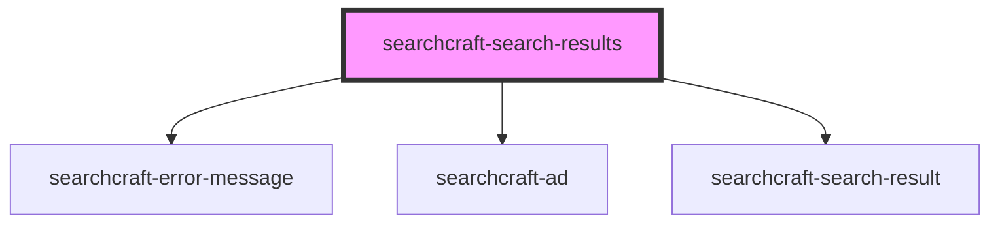

# searchcraft-search-results


<!-- Auto Generated Below -->


## Overview

This web component is responsible for displaying the results of a search query.
Once a query is submitted, the component formats and presents an ordered list of the results.

## Usage
```html
<!-- index.html -->
<searchcraft-search-results
  ad-interval="4"
  place-ad-at-start="false"
/>
```

```js
// index.js
const searchResults = document.querySelector('searchcraft-search-results');

searchResults.template = (item, index, { html }) => html`
 <h2>${item.title}</h2>
`;

searchResults.addEventListener('noResults', () => {
  console.log('No search results found');
});
```

## Properties

| Property   | Attribute | Description                                                                                    | Type                                                                                  | Default     |
| ---------- | --------- | ---------------------------------------------------------------------------------------------- | ------------------------------------------------------------------------------------- | ----------- |
| `template` | --        | A callback function responsible for rendering a result. Passed to `searchcraft-search-result`. | `((data: any, index: number, utils: { html: TemplateHtml; }) => string) \| undefined` | `undefined` |


## Dependencies

### Depends on

- [searchcraft-error-message](../searchcraft-error-message)
- [searchcraft-ad](../searchcraft-ad)
- [searchcraft-search-result](../searchcraft-search-result)

### Graph


----------------------------------------------

*Built with [StencilJS](https://stenciljs.com/)*
