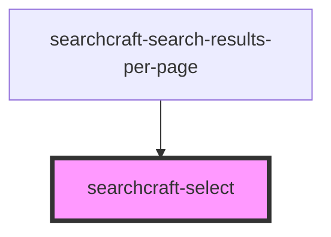

# searchcraft-select


<!-- Auto Generated Below -->


## Overview

This web component is designed to allow users to select between a group of options.

## Usage
```html
<!-- index.html -->
<searchcraft-select
 inputId="searchcraft-select"
 name="searchcraft-select"
 options="[{ label: 'label', value: 'value' }]"
/>
```

## Properties

| Property               | Attribute  | Description                                   | Type                                  | Default     |
| ---------------------- | ---------- | --------------------------------------------- | ------------------------------------- | ----------- |
| `caption`              | `caption`  | The caption displayed below the select input. | `string \| undefined`                 | `undefined` |
| `disabled`             | `disabled` | Whether the select input is disabled.         | `boolean \| undefined`                | `false`     |
| `inputId` _(required)_ | `input-id` | The ID for the select input.                  | `string`                              | `undefined` |
| `label`                | `label`    | The label of the select input.                | `string \| undefined`                 | `undefined` |
| `labelId`              | `label-id` | The ID for the label of the select input.     | `string \| undefined`                 | `undefined` |
| `name` _(required)_    | `name`     | The name of the select input.                 | `string`                              | `undefined` |
| `options`              | `options`  | The options for the select input.             | `SearchcraftSelectOption[] \| string` | `[]`        |


## Events

| Event          | Description                                 | Type                  |
| -------------- | ------------------------------------------- | --------------------- |
| `selectChange` | The event fired when the select is changed. | `CustomEvent<string>` |


## Dependencies

### Used by

 - [searchcraft-search-results-per-page](../searchcraft-search-results-per-page)

### Graph


----------------------------------------------

*Built with [StencilJS](https://stenciljs.com/)*
